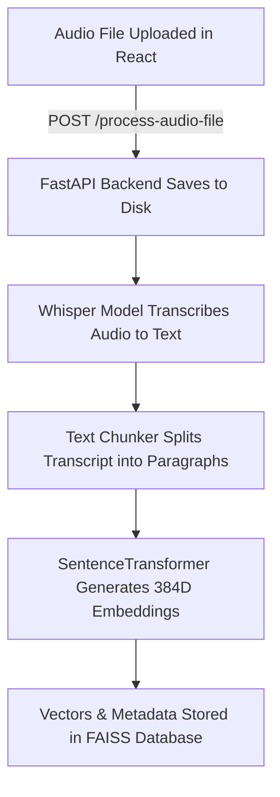
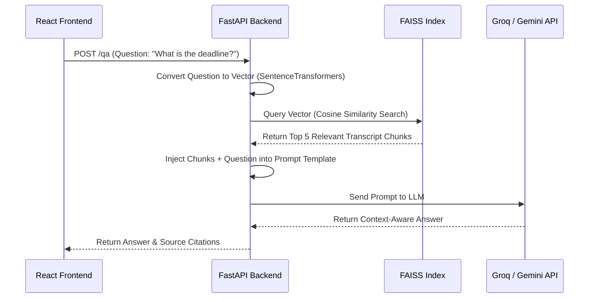

# 🎙️ AI Conversation Intelligence System - Interview Guide

This guide is designed to help you explain the project clearly and confidently during an interview. It explains the project architecture, the core workflows (audio processing & RAG), and the technical challenges you solved.

---

## 1. Project Overview (The "Elevator Pitch")
> *"This project is an **AI-powered Conversation Intelligence System** that converts audio files (like meeting recordings or support calls) into structured insights. It performs speech-to-text transcription, automatically extracts summaries, sentiments, and action items, and features a **RAG (Retrieval-Augmented Generation)** Q&A pipeline that allows users to ask natural language questions about their conversations."*

---

## 2. Technical Architecture & Tech Stack
Explain the technologies used and how they are organized:
- **Frontend**: Built with **React.js, Tailwind CSS, and Vite** (clean, responsive, dynamic SPA).
- **Backend**: **FastAPI** (Python) - chosen for its speed, automatic Swagger documentation, and native support for asynchronous requests.
- **Speech-to-Text**: **OpenAI Whisper** model (running locally on CPU).
- **Embeddings**: **SentenceTransformers** (specifically the `all-MiniLM-L6-v2` model, which converts text into 384-dimensional semantic vectors).
- **Vector Database**: **FAISS** (Facebook AI Similarity Search) - an in-memory vector database used for ultra-fast similarity search.
- **LLM Pipeline**: Powered by **Groq Cloud API** (Llama 3.1 8B) for high-speed inference, with support for **Gemini** and **OpenAI**.

---

## 3. End-to-End Workflow: How an Audio File Becomes an Answer

Here is the exact lifecycle of a file in the system:

### Step 1: Upload & File Handling
1. The user drags and drops an audio file (e.g., MP3 or WAV) in the React UI.
2. The frontend sends it via a `multipart/form-data` request to the backend `/process-audio-file` endpoint.
3. The backend saves the audio file securely on disk in the `data/uploads/` directory.

### Step 2: Speech-to-Text Transcription
1. The backend loads the **OpenAI Whisper** model.
2. Whisper processes the audio file frame-by-frame and converts the speech into a raw text transcript.

### Step 3: Text Chunking
1. Raw transcripts are too large to send to LLMs in one go (due to context window limits).
2. The **Text Chunker** module groups the transcript into smaller, overlapping paragraphs (~500 characters each). The overlap ensures context isn't lost at the boundaries.

### Step 4: Embedding Generation & FAISS Indexing
1. The backend passes each chunk through the **SentenceTransformers** model to generate a **384-dimensional vector embedding** (a numeric representation of the semantic meaning of that text).
2. The vectors and their corresponding text metadata are inserted into the **FAISS Vector Index**. The index is saved to disk so it persists across restarts.

---

## 4. The RAG (Retrieval-Augmented Generation) Pipeline

When a user asks a question like: *"What were the deadlines discussed?"*, the system runs a RAG pipeline:

1. **Question Vectorization**: The user types a question in the Q&A panel. The backend converts the question into a 384-dimensional embedding using the same `SentenceTransformers` model.
2. **Semantic Retrieval**: FAISS performs a similarity search (using L2 distance/cosine similarity) between the question vector and all stored transcript vectors. It returns the top 5 most relevant conversation segments.
3. **Context Injection**: The backend constructs a system prompt:
   > *"You are an AI assistant. Answer the user's question based ONLY on the following context retrieved from the meeting transcript: [Context Chunks]. Question: [User's Question]"*
4. **LLM Generation**: The prompt is sent to the LLM (e.g. Llama 3.1 8B on Groq).
5. **Citations**: The LLM generates a precise answer. The backend sends the answer back to the UI, along with the specific source segments so the user can verify the facts.

---

## 5. Engineering Challenges & Problem-Solving
*Highlighting these during an interview shows you are a strong developer who can debug real-world issues:*

### Challenge 1: Memory Constraints for Server Deployment
- **Problem**: Running PyTorch, local Whisper models, and SentenceTransformers locally uses over **1 GB of RAM**. When deploying to free-tier cloud platforms like Render (which limits memory to **512 MB**), the server crashed instantly with Out-of-Memory (OOM) errors.
- **Solution**: Refactored the architecture to support cloud APIs. We offload transcription to **Groq's Whisper API** and embeddings to **Gemini's Embedding API (`text-embedding-004`)**. This removes the massive PyTorch library entirely from dependencies, dropping server memory usage from **1 GB to under 80 MB**, allowing cheap, lightning-fast deployment on Render.

### Challenge 2: Single-Chunk Dimension Crash (Edge Case)
- **Problem**: When a conversation was short enough to result in exactly **one chunk**, the embedding encoder compressed the array and returned a 1D vector instead of a 2D matrix. This caused FAISS to crash with `ValueError: not enough values to unpack`.
- **Solution**: Fixed the dimension unpacking bug in `embedder.py`. We updated the encoder to inspect the input type; if a list of items is provided, it always returns a 2D matrix (even for single-element lists), ensuring input size consistency for the vector store.

### Challenge 3: Incomplete Context & Text Truncation
- **Problem**: The backend processing endpoints were hardcoded to truncate the returned transcription to **500 characters** (e.g., `"transcription": text[:500] + "..."`). This caused the Summarizer and Sentiment Analyzer widgets on the frontend to receive only a fraction of the conversation.
- **Solution**: Removed the 500-character preview limitation from `/process-conversation` and `/process-audio-file` in `main.py`, ensuring the frontend receives the full transcript for proper analysis.

### Challenge 4: Large File Download Truncation
- **Problem**: The frontend "Download" button converted text to a Data URI (`data:text/plain;...`), which got cut off by web browsers when downloading long transcripts due to URL size limitations.
- **Solution**: Refactored the React download handler to use a **Blob-based** stream (`URL.createObjectURL(new Blob([text]))`). This completely bypasses browser URL limits, supporting files of any length.

### Challenge 5: Model Deprecations (API Lifecycle Management)
- **Problem**: The Groq API returned `400 Bad Request` errors because the model configured in `.env` (`llama3-8b-8192`) had been decommissioned.
- **Solution**: Updated config structures to dynamically direct requests to Groq's active successor model (`llama-3.1-8b-instant`), restoring pipeline integrity.
